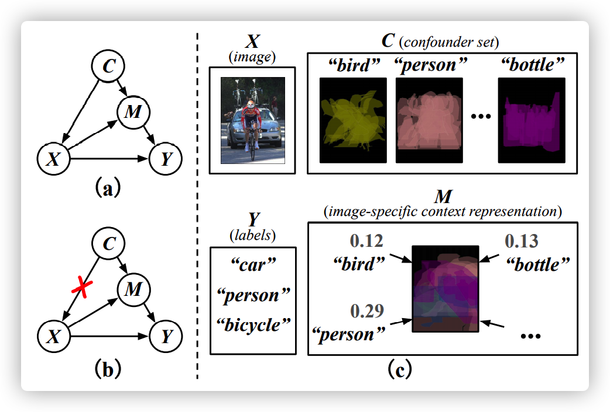
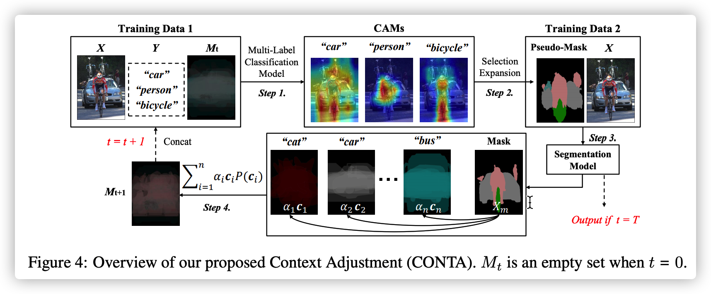

# Causal Intervention for Weakly Supervised Semantic Segmentation 
The main code for:

Causal Intervention for Weakly Supervised Semantic Segmentation.
Dong Zhang, Hanwang Zhang, Jinhui Tang, Xiansheng Hua, and Qianru Sun.
NeurIPS, 2020. [[CONTA]](https://arxiv.org/abs/2009.12547)


## 论文阅读

### 问题
不完美的pseudo-mask无非就以下两种基本的情况：
1. 没cover到完整的区域(Incomplete Foreground)；
2. 超出了本身的区域。对于第二种情况我们又将其分为两种具体的case：
    - 超出到了其他前景目标区域中(Object Ambiguity)
    - 超出到了背景区域中(Incomplete Background)。

简而言之，就是：本应是别的前景变成这个前景、本应是背景变前景和本应是前景变背景。

### 原因
用结构化因果模型来阐释为什么会产生这些问题：

C是数据集的上下文先验，X是输入图像，Y是图像对应的类别标签，M被认为是X在上下文先验C下的一个具体的表示。

举个例子，只要有“马”出现的时候，那么一般同时都会有“人”的存在，那么分类模型就会把“马”和“人”进行关联，导致马的部分的CAM会落到人所在的像素区域中。

### 解决方法
使用因果干预切断上下文先验和图像之间的关联。

最好的方法：
获得这样一个数据集——其中不同种类的目标的各种角度均被放在所有可能的上下文中进行了拍摄。

退而求其次：
通过切断上下文先验C和图像X之间的关联，使得X能和每一种C都公平地进行结合，从而打破弱监督语义分割模型在分类过程中的X和Y之间的虚假关联，以产生质量更高的CAM用于seed area。

但是在WSSS任务中，上下文先验C本身是不可知的。本文使用Class-Specific Average Mask来近似构建一个Confounder set，其中Confounder Set中的每一项是通过对每个类的mask进行平均后获得的均值。M是C的线性组合。

### 方法

1. 通过初始化弱监督语义分割模型获取图像的mask信息
2. 构建Confounder set并去除confounder
3. 将去除confounder后的mask拼接到下一轮的分类模型的backbone中以产生更高质量的CAM，产生的CAM又可以用来产生更高质量的mask

循环几次上面三个步骤。

---

## Requirements

* PyTorch 1.2.0, torchvision 0.4.0, and more in requirements.txt
* PASCAL VOC 2012 devkit and COCO 2014
* 8 NVIDIA GPUs, and each has more than 1024MB of memory

## Usage

### Install python dependencies

```
pip install -r requirements.txt
```

### Download PASCAL VOC 2012 and COCO

* PASCAL VOC 2012 in http://host.robots.ox.ac.uk/pascal/VOC/voc2012/#devkit
* COCO 2014 in https://cocodataset.org/

### To generate pseudo_mask:

For pseudo-mask generaction, we follow the method in [IRNet](https://arxiv.org/abs/1904.05044) without the instance-wise step.

```
cd pseudo_mask & python run_sample.py
```
* You can either mannually edit the file, or specify commandline arguments.
* Remember to replace the ground_truth annotation in PASCAL VOC 2012 with the generated pseudo_mask.

### To train the supervised semantic segmentation model:

```
cd segmentation & python main.py train --config-path configs/voc12.yaml
```

### To evaluate the performance on validation set:

```
python main.py test --config-path configs/voc12.yaml \
    --model-path data/models/voc12/deeplabv2_resnet101_msc/train_aug/final_model.pth
```

### To re-evaluate with a CRF post-processing:<br>

```
python main.py crf --config-path configs/voc12.yaml
```

### Common setting:

* Model: DeepLab v2 with ResNet-101 backbone. Dilated rates of ASPP are (6, 12, 18, 24). Output stride is 8 times.
* GPU: All the GPUs visible to the process are used. Please specify the scope with CUDA_VISIBLE_DEVICES=0,1,2,3.
* Multi-scale loss: Loss is defined as a sum of responses from multi-scale inputs (1x, 0.75x, 0.5x) and element-wise max across the scales. The unlabeled class is ignored in the loss computation.
* Learning rate: Stochastic gradient descent (SGD) is used with momentum of 0.9 and initial learning rate of 2.5e-4. Polynomial learning rate decay is employed; the learning rate is multiplied by ```(1-iter/iter_max)**power``` at every 10 iterations.
* Monitoring: Moving average loss (average_loss in Caffe) can be monitored in TensorBoard.
* Preprocessing: Input images are randomly re-scaled by factors ranging from 0.5 to 1.5, padded if needed, and randomly cropped to 321x321.
* You can find more useful tools in /tools/xxx.


### Training batch normalization

This codebase only supports DeepLab v2 training which freezes batch normalization layers, although
v3/v3+ protocols require training them. If training their parameters on multiple GPUs as well in your projects, please
install [the extra library](https://hangzhang.org/PyTorch-Encoding/) below.

```bash
pip install torch-encoding
```

Batch normalization layers in a model are automatically switched in ```libs/models/resnet.py```.

```python
try:
    from encoding.nn import SyncBatchNorm
    _BATCH_NORM = SyncBatchNorm
except:
    _BATCH_NORM = nn.BatchNorm2d
```

### Inference Demo

To process a single image:

```
python tools/demo.py single \
    --config-path configs/voc12.yaml \
    --model-path model.pth \
    --image-path image.jpg
```

To run on a webcam:

```
python tools/demo.py live \
    --config-path configs/voc12.yaml \
    --model-path model.pth
```

## Citation

If you find the code useful, please consider citing our paper using the following BibTeX entry.
```
@InProceedings{dong_2020_conta,
author = {Dong, Zhang and Hanwang, Zhang and Jinhui, Tang and Xiansheng, Hua and Qianru, Sun},
title = {Causal Intervention for Weakly Supervised Semantic Segmentation},
booktitle = {NeurIPS},
year = 2020
}
```

## References

1. L.-C. Chen, G. Papandreou, I. Kokkinos, K. Murphy, A. L. Yuille. DeepLab: Semantic Image
Segmentation with Deep Convolutional Nets, Atrous Convolution, and Fully Connected CRFs. *IEEE TPAMI*,
2018.<br>
[Project](http://liangchiehchen.com/projects/DeepLab.html) /
[Code](https://bitbucket.org/aquariusjay/deeplab-public-ver2) / 
[Paper](https://arxiv.org/abs/1606.00915)

2. M. Everingham, L. Van Gool, C. K. I. Williams, J. Winn, A. Zisserman. The PASCAL Visual Object
Classes (VOC) Challenge. *IJCV*, 2010.<br>
[Project](http://host.robots.ox.ac.uk/pascal/VOC) /
[Paper](http://host.robots.ox.ac.uk/pascal/VOC/pubs/everingham10.pdf)

3. Ahn, Jiwoon and Cho, Sunghyun and Kwak, Suha. Weakly Supervised Learning of Instance Segmentation with Inter-pixel Relations. *CVPR*, 2019.<br>
[Project](https://github.com/jiwoon-ahn/irn) /
[Paper](https://arxiv.org/abs/1904.05044)

## TO DO LIST

* Training code for MS-COCO
* Code refactoring
* Release the checkpoint

## Questions

Please contact 'dongzhang@njust.edu.cn'